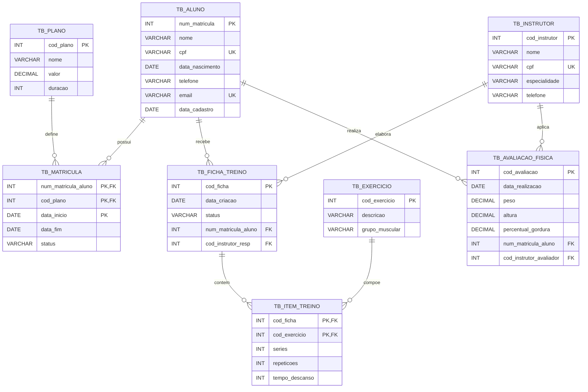

# Banco de Dados para Gestão de Academia

Projeto acadêmico de modelagem e implementação de um banco de dados relacional para apoiar a gestão de uma academia.

A solução organiza informações sobre alunos, instrutores, planos, matrículas, fichas de treino, exercícios e avaliações físicas. Além da definição do esquema, o projeto inclui dados de demonstração e consultas que exploram diferentes recursos da linguagem SQL.

## Objetivos

- representar as principais entidades e regras de negócio de uma academia;
- garantir a integridade dos dados com chaves primárias, estrangeiras e restrições;
- consultar informações relacionadas por meio de junções e subconsultas;
- demonstrar agregações, operações de conjuntos e consultas correlacionadas;
- manter os scripts organizados e reproduzíveis.

## Tecnologias

- MySQL 8.0.31 ou superior;
- SQL (DDL, DML e DQL);
- MySQL Workbench ou cliente de linha de comando.

> A versão 8.0.31 ou superior é recomendada porque o arquivo de consultas utiliza `INTERSECT` e `EXCEPT`.

## Modelo relacional



## Estrutura do repositório

```text
banco-de-dados-academia/
├── README.md
├── .gitignore
├── docs/
│   └── dicionario-de-dados.md
└── sql/
    ├── 01_schema.sql
    ├── 02_seed.sql
    └── 03_queries.sql
```

## Como executar

### MySQL Workbench

1. Abra e execute `sql/01_schema.sql` para criar o banco e as tabelas.
2. Execute `sql/02_seed.sql` para inserir os dados de demonstração.
3. Abra `sql/03_queries.sql` e execute individualmente as consultas que deseja analisar.

### Linha de comando

```bash
mysql -u seu_usuario -p < sql/01_schema.sql
mysql -u seu_usuario -p < sql/02_seed.sql
mysql -u seu_usuario -p < sql/03_queries.sql
```

> Atenção: `01_schema.sql` recria o schema `academia_trabalho`. Não execute esse arquivo em um banco que contenha dados que devam ser preservados.

## Consultas demonstradas

O arquivo `03_queries.sql` contém exemplos de:

- `INNER JOIN`, `LEFT JOIN` e `RIGHT JOIN`;
- agregações com `COUNT`, `AVG`, `GROUP BY` e `HAVING`;
- subconsultas simples e correlacionadas;
- `EXISTS` e `NOT EXISTS`;
- `INTERSECT` e `EXCEPT`;
- operador `ANY`;
- consultas envolvendo múltiplas tabelas.

Os dados de demonstração foram planejados para produzir casos relevantes, incluindo alunos sem ficha de treino, planos sem matrículas, exercícios não utilizados e instrutores sem atividades registradas.

## Decisões de modelagem

- `TB_MATRICULA` utiliza chave primária composta para permitir o histórico de planos de um aluno.
- `TB_ITEM_TREINO` resolve o relacionamento muitos-para-muitos entre fichas e exercícios.
- As fichas e avaliações mantêm referências aos respectivos instrutores responsáveis.
- Restrições `CHECK`, `UNIQUE` e `FOREIGN KEY` protegem regras essenciais do domínio.
- Índices auxiliares atendem colunas usadas em relacionamentos e filtros frequentes.

Para a descrição de cada atributo, consulte o [dicionário de dados](./docs/dicionario-de-dados.md).

## Autor

**Matheus Calazans**  
Ciência da Computação — Universidade Estadual de Maringá

- [GitHub](https://github.com/matheus-calaz)
- [LinkedIn](https://www.linkedin.com/in/matheus-am-calazans)

